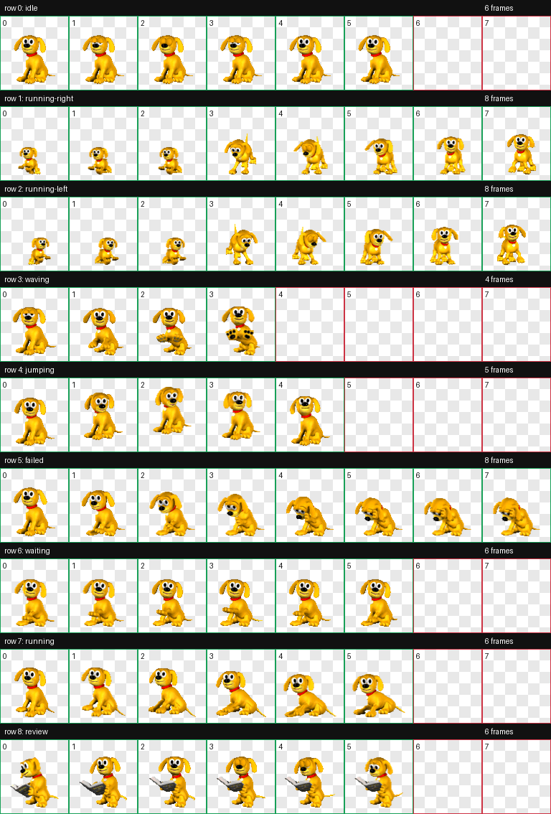

# Rover the Dog for Codex pet

The golden dog from Windows XP, packaged as a Codex custom pet.

## Files

- `pet.json` - pet manifest
- `spritesheet.webp` - pet animation spritesheet
- `contact-sheet.png` - animation preview



## Install

```bash
mkdir -p ~/.codex/pets/rover
cp pet.json spritesheet.webp ~/.codex/pets/rover/
```

Restart Codex, then choose `Rover the Dog` in the pet settings.

## Credits

Converted from Rover animation assets collected in [youngjae99/rover-app](https://github.com/youngjae99/rover-app).
Rover and the original Windows XP assets belong to their respective rights holders.
